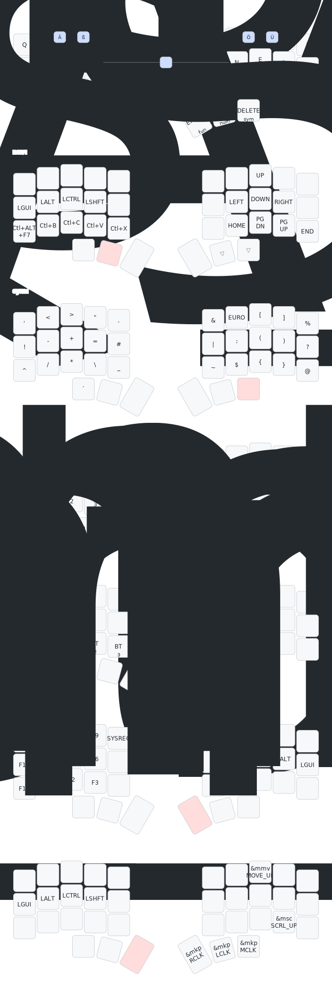

# zmk-config

This is a [ZMK](https://zmk.dev) config repo for my [chocofi](https://github.com/pashutk/chocofi), a 36 key split keyboard, arranged in 3 rows of 5 columns with 3 thumb keys on each side.

It uses Miryoku inspired layout, with some modifications. I added timeless home row mods and used German Keys in a Colemak DH layout. 

## Keymaps

Illustrations powered by [keymap-drawer](https://caksoylar.github.io/keymap-drawer?keymap_yaml=H4sIAAAAAAAC_51WW3fSQBB-768Yb0TtYhvoNccbhASw4dIQaLUiphBOe0gIJ4F6sOKTv6FPnuMv8cl_4i9xNjc2IbXow86yM7OzM998u8HU5_ZsKsD1Z2vUGxnzc1t3BgL0bWdsEDA9a2-sW4YAw8sro9e3zZk17k0dfewObcdabKCP4bjCBsDAGOozc0p_ZuHsmMAJAZlAk0Cx6-veEFAItAm8JcDd53xtFq4xgQKBCwEUSdag3K4u0AKBRV1aCorGWlq-RdRUhVXLyw2tSlWOtpSD42qMb93zVavlSsKZGiXfmIxfZfYkMmqsVIFVvyNwSkAkUCLQCZA4IlBBDAhH4BnOr2JYSC2x0JRArBTUgqhJPgCWMbjUY9U3C6Kf4Vi_Yg1aoejvsGeuEaunHgYbzsasoVgQj5hwM2vBZFOSFEnzLe7cs-B5QZM5zD8-unFDu5kwKIgLsgBxI37ncGpVZC2xl0KIgDVOsEEe0imxxam5KfpTx59OGY9Ko4ZJN8tQqnsTzUSql0KcOS6qfz5Bdl8Y5iCEJLIxTgL8vvlJwHf26M9ilGZDsCKUaELPMeuXnEd8bHqYaQYXUltF4nBn1Nil4lFU6j26zKLYxPkFXTyIbF_oUkDxmMAThkRnHwhs4fopmt4T6IX-X3H9EPXXdN-CitdRrI-3NHIFHyQH2_t9Kg6oOExrfzovdqjYpWIvaQu4EDLDpwlSht3OU5GjIr_OmdjG7aihWe4vPY4V6kWkEbyLF9acObftqWnrA8OhR2TcudtzDNeYphXbRMo1VQnJWZdOtRV3NtZduNXa9Ap2GopHZzonb1YWihqIispea827tVj-IkXLp2pzqdo8t7gL5LXuUfxHBDE-RwHAMp_Dj8Y-jgMchwRab1uqdHwXPDLPo_sOjl0ce_9GKpnfxk00AD07vx6l1ubRarXeu7zuA8plLOsKao2O1Gs3uf97TJkY9F2Na-gbG9d47-16tzljuX1oiarCBA41y8Chxi9guU4etC6aGWs0wc-ycsTFNEqg8RNDRY0quht92zq38R9KFiYCnGGfc_S4kQC_vuFsoi7459INXJAG-dDlR7oLUmw_dLlJd0ESH4Qu3285CE_KhUdtpfvwSEh-L_DhMn194vY-2c6AS7r_Af0_AinLCQAA)

### layout

